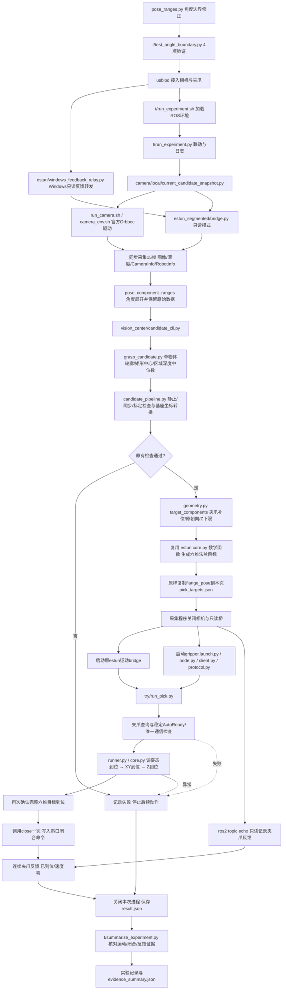

# 本次实验顺序逻辑图

```mermaid
flowchart TD
    FIX[pose_ranges.py 角度边界修正] --> TEST[t/test_angle_boundary.py 4项验证]
    TEST --> USB[usbipd 接入相机与夹爪]
    USB --> RELAY[estun/windows_feedback_relay.py Windows只读反馈转发]
    USB --> SHELL[t/run_experiment.sh 加载ROS环境]
    SHELL --> MAIN[t/run_experiment.py 联动与日志]
    MAIN --> SNAP[camera/local/current_candidate_snapshot.py]
    SNAP --> CAMERA[run_camera.sh / camera_env.sh 官方Orbbec驱动]
    SNAP --> RB[estun_segmented/bridge.py 只读模式]
    RELAY --> RB
    CAMERA --> CAP[同步采集15帧 图像/深度/CameraInfo/RobotInfo]
    RB --> CAP
    CAP --> RANGE[pose_component_ranges 角度展开并保留原始数据]
    RANGE --> CLI[vision_center/candidate_cli.py]
    CLI --> POINT[grasp_candidate.py 单物体轮廓/矩形中心/区域深度中位数]
    POINT --> BASE[candidate_pipeline.py 静止/同步/标定检查与基座坐标转换]
    BASE --> PASS{原有检查通过?}
    PASS -- 否 --> ABORT[记录失败 停止后续动作]
    PASS -- 是 --> TARGET[geometry.py target_components 夹爪补偿/原朝向/Z下限]
    TARGET --> MATH[复用 estun core.py 数学函数 生成六维法兰目标]
    MATH --> CONFIG[原样复制flange_pose到本次pick_targets.json]
    CONFIG --> CLEAN[采集程序关闭相机与只读桥]
    CLEAN --> BRIDGE[启动原estun运动bridge]
    CLEAN --> GRIP[启动gripper.launch.py / node.py / client.py / protocol.py]
    CLEAN --> MON[ros2 topic echo 只读记录夹爪反馈]
    BRIDGE --> PICK[try/run_pick.py]
    GRIP --> PICK
    PICK --> READY[夹爪查询与稳定AutoReady/唯一通信检查]
    READY --> MOVE[runner.py / core.py 调姿态到位 → XY到位 → Z到位]
    MOVE --> CHECK[再次确认完整六维目标到位]
    CHECK --> CLOSE[调用close一次 写入串口闭合命令]
    CLOSE --> FB[连续夹爪反馈 已到位/速度零]
    MON --> FB
    READY -. 失败 .-> ABORT
    MOVE -. 异常 .-> ABORT
    FB --> END[关闭本次进程 保存result.json]
    ABORT --> END
    END --> SUMMARY[t/summarize_experiment.py 核对运动/闭合/反馈证据]
    SUMMARY --> REPORT[实验记录与evidence_summary.json]
```

本次实际发送3条机械臂命令和1次闭合命令。没有额外开爪、抬升、返回、重试或人工选点。设备动作完成与物体实际夹持是两项不同证据；后者未由现有传感器验证。
